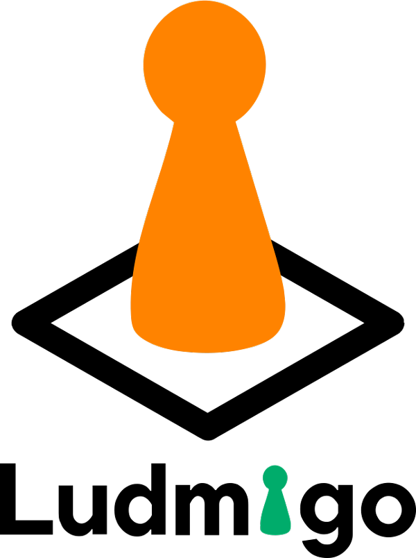

# Ludmigo | Democratize the game!

Ludmigo is a community platform for sharing and discovering
board games, making it easy to find people and places to play.

It doesn't matter whether you're a beginner or an amateur, what counts is
the desire to share a convivial moment and meet up over a game.
This can take place in the dedicated venues already present in their town or
or in bars that we can help to develop this service with in their establishments.

With Ludmigo, let's democratize board games!

# Laravel + Vue Starter Kit

## Introduction

Our Vue starter kit provides a robust, modern starting point for building Laravel applications with a Vue frontend using [Inertia](https://inertiajs.com).

Inertia allows you to build modern, single-page Vue applications using classic server-side routing and controllers. This lets you enjoy the frontend power of Vue combined with the incredible backend productivity of Laravel and lightning-fast Vite compilation.

This Vue starter kit utilizes Vue 3 and the Composition API, TypeScript, Tailwind, and the [shadcn-vue](https://www.shadcn-vue.com) component library.

## Official Documentation

Documentation for all Laravel starter kits can be found on the [Laravel website](https://laravel.com/docs/starter-kits).

## Contributing

Thank you for considering contributing to our starter kit! The contribution guide can be found in the [Laravel documentation](https://laravel.com/docs/contributions).

## Code of Conduct

In order to ensure that the Laravel community is welcoming to all, please review and abide by the [Code of Conduct](https://laravel.com/docs/contributions#code-of-conduct).

## License

The Laravel + Vue starter kit is open-sourced software licensed under the MIT license.